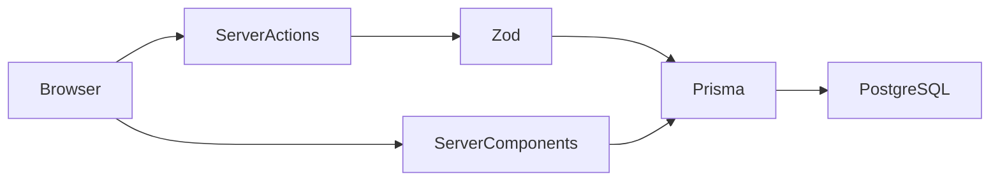

# Architecture

The application uses one direct path from UI to data storage:

- `app/`: App Router pages and mutation actions
- `components/`: reusable application UI and `components/ui` primitives
- `lib/`: Prisma client, validation, labels, and small pure functions
- `prisma/`: three models, migration, and seed
- `tests/`: business-logic tests and end-to-end scenarios

There is no separate API, repository, service, domain engine, or client state
layer. Vitest checks pure logic; Playwright checks the running application.
